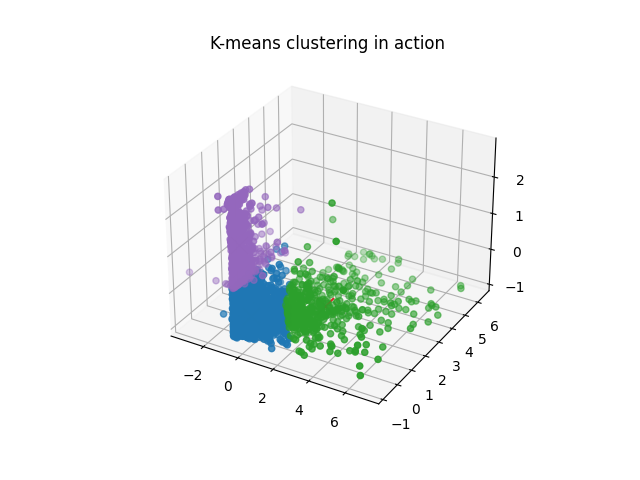
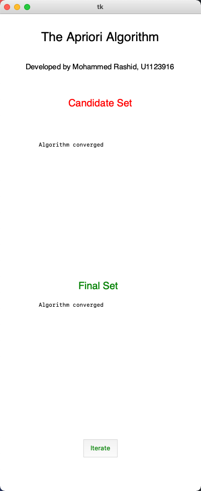

# Use Instructions

## Prerequisites

### Install Python3
Prior to executing any of the ```*.py``` files in this folder, please make sure that Python 3 is installed on your computer. Click [here](https://www.python.org/downloads/) to learn how to install Python 3. You may also prefer to have multiple versions of python running on your computer. In that case, click [here](https://docs.python.org/3/library/venv.html) to learn how to create Python virtual environments.

### Install required packages

The packages required to successfully execute any ```*.py``` file are stored in the ***requirements.txt*** file. Run the following command to install all packages using the ```pip``` package manager, which is installed after downloading python.

```bash
pip install -r requirements.txt
```
 
<br/>

## K-means Clustering UI
Perform the following tasks to visualize the operation of the K-means clustering algorithm. The algorithm uses the data in **sample.csv** to perform clustering. If you prefer to use your own dataset, please make sure your data has exactly **two dimensions** with label names, ***x*** and ***y***.

### Step 1:
Run the following code in the command line (Make sure you're in the K-apriori directory).
```bash
python3 kmeansUI.py
```

You should see the first screen of the K-means application


### Step 2: 
Enter the number of clusters, *k*, in the input field.

### Step 3:
Upload the **sample.csv** file by clicking on the **Import CSV file** button.

### Step 4:
Click on the **Iterate** button to visualize the operation of the K-means clustering. Keep clicking until the application notifies you that the stopping condition has been reached.


### Step 5: Bonus step
If you want to restart the clustering process, you can click on the **Restart** button.

<br/>

## K-means Clustering with RFM Data
You can also perform K-means clustering with real world data. The data used in this example comprises the ***recency***, ***frequency***, and ***monetary value*** of customers' purchases from an online retail store. To see a demo, run the following command.

```bash
python3 kmeans.py
```

Here's a plot of ***frequency***, ***recency***, and ***monetary value*** dimensions after clustering.



<br/>

<br/>

## The Apriori Algorithm UI
The apriori application uses the data in the **my_orders.csv** file. The file comprises data about the order and product information from The Instacart Online Grocery Shopping Dataset 2017. The ***order_id*** is a unique 1-digit code for a transaction whereas the ***product_id*** is a unique 5 digit code for a product.  Perform the following tasks to visually inspect how the aprior algorithm works.

### Step 1:
Run the following command in the command line
```bash
python3 apriori-UI.py
```

You should see the first screen of the application.


### Step 2:
Click on the **Iterate** button to see apriori in action. Keep clicking on the button until the algorithm converges.

<div style="display: flex;">
    
    
</div>


<br/>

## The Apriori Algorithm with Order and Product Information.
The apriori algorithm is supposed to produce association rules that are evaluated based on their confidence and lift. Run the following command to see the association rules and their corresponding features. The data used for this demo can be found in ***my_orders.csv***.

```bash
python3 apriori.py
```

The association rules are shown in the command line.

```bash
Association Rules
------------------

                                      rules  confidence  lift
0         (26358,) -> (26358, 96553, 32654)        0.67  1.04
1         (96553,) -> (26358, 96553, 32654)        0.50  1.04
2         (32654,) -> (26358, 96553, 32654)        0.50  1.04
3   (26358, 96553) -> (26358, 96553, 32654)        1.00  1.04
4   (26358, 32654) -> (26358, 96553, 32654)        0.67  1.04
5   (96553, 32654) -> (26358, 96553, 32654)        0.67  1.04
6         (57565,) -> (57565, 96553, 32654)        0.67  1.04
7         (96553,) -> (57565, 96553, 32654)        0.50  1.04
8         (32654,) -> (57565, 96553, 32654)        0.50  1.04
9   (57565, 96553) -> (57565, 96553, 32654)        0.67  1.04
10  (57565, 32654) -> (57565, 96553, 32654)        1.00  1.04
11  (96553, 32654) -> (57565, 96553, 32654)        0.67  1.04
```


